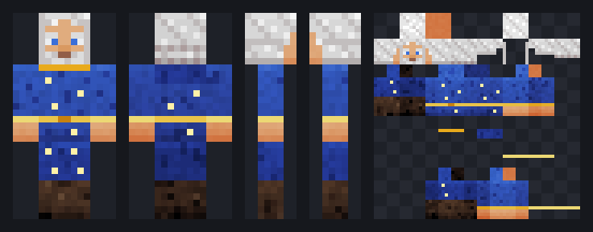

# Texel

Texel is a format and a toolchain for making Minecraft textures as code. A texture is a JSON
spec: a palette and an ordered list of drawing operations addressed to named parts and faces of
the model (`head.front`, `rightArm.sides@overlay`). A compiler turns the spec into the PNG the game
reads, the same bytes every time, and a review returns what is wrong with it as JSON paths, fix
hints, an art score and pixel-art advice. The tools are built for AI agents: an MCP server, a
command-line tool and an Agent Skill, also packaged as a Claude Code plugin.

It covers player skins (classic and slim) and, through layouts, 25 other textures: mobs such as
zombies, skeletons, creepers, pigs, wolves and iron golems, armor layers, capes with elytra, and
16 × 16 items and blocks, all in the Java Edition 1.21 texture layouts.

Texel is open source (MIT) and in development, at version 0.8.0. The format is versioned (`version: 1`)
but may still change between minor releases. Treat everything as a beta. The site
[texel.dev.br](https://www.texel.dev.br) is built on this toolchain.



The image above is the review sheet the tools return for this spec. It is the `wizard` example
without its `$schema`, `description`, `author` and `tags` fields and the layers' `note` comments,
which do not change the pixels (both compile to the same PNG):

```json
{
  "version": 1,
  "name": "Star Wizard",
  "model": "classic",
  "palette": {
    "skin": "#e0ac7e", "robe": "#2f4fb0", "gold": "#e8c34a", "beard": "#dcdcdc",
    "eyes": "#3a6fd9", "boots": "#4a3324", "star": "#fff1a8"
  },
  "layers": [
    { "op": "material", "target": "all", "color": "skin", "kind": "skin" },
    { "op": "material", "target": "body+arms", "color": "robe", "kind": "fabric" },
    { "op": "material", "target": "legs", "color": "robe~-1", "kind": "fabric" },
    { "op": "material", "target": "arms", "region": "hands", "color": "skin", "kind": "skin" },
    { "op": "rect", "target": "arms.sides", "region": "cuffs", "color": "gold" },
    { "op": "material", "target": "legs", "region": "boots", "color": "boots", "kind": "leather" },
    { "op": "face", "id": "face", "skin": "skin", "eyes": "eyes", "brows": "beard", "beard": "full", "beardColor": "beard", "mouth": "smile" },
    { "op": "hair", "id": "hair", "color": "beard", "style": "long", "fringe": "parted" },
    { "op": "lighting" },
    { "op": "rect", "target": "body.sides", "region": "belt", "color": "gold" },
    { "op": "points", "target": "body.front", "points": [[3, 8], [4, 8]], "color": "gold~-2" },
    { "op": "points", "target": "body.front+back", "points": [[1, 2], [6, 4], [2, 6], [5, 10]], "color": "star" },
    { "op": "points", "target": "legs.front", "points": [[1, 1], [2, 4]], "color": "star" },
    { "op": "material", "id": "hood", "target": "body.back@overlay", "y": 0, "h": 3, "color": "robe~-1", "kind": "fabric" },
    { "op": "rect", "target": "body.front@overlay", "region": "collar", "color": "gold~-1" },
    { "op": "rect", "target": "arms.sides@overlay", "region": "cuffs", "color": "gold~1" }
  ]
}
```

The 64 × 64 texture it compiles to is [docs/images/wizard.png](docs/images/wizard.png).

## Installing

The MCP server and the CLI need Node 20 or later.

**Claude Code plugin.** This repository is a plugin marketplace. The plugin starts the MCP server
from a single bundled file (no `npm install`) and adds the `minecraft-skin-design` skill. Files are
written to the project directory.

```
/plugin marketplace add Brunovncs/texel-mcp
/plugin install texel@texel
```

**Any MCP client.** The package is named `texel-mcp`. It is not on npm yet; once it is published,
this configuration works in Claude Desktop, Cursor, VS Code and other clients that read the usual
`mcpServers` format:

```json
{
  "mcpServers": {
    "texel": {
      "command": "npx",
      "args": ["-y", "texel-mcp", "--workspace", "/absolute/path/skins"]
    }
  }
}
```

In Claude Code the same is `claude mcp add texel -- npx -y texel-mcp`. Until then, build it from
this repository (see [Building and testing](#building-and-testing)) and point the client at the
file: `"command": "node", "args": ["/absolute/path/texel-mcp/dist/texel-mcp.mjs", "--workspace",
"/absolute/path/skins"]`. `plugin/server/texel-mcp.mjs` is the same server with its dependencies
bundled, and runs from anywhere with plain `node`.

**CLI.** `npx -y -p texel-mcp texel-cli build skin.json -o skin.png --sheet sheet.png` after
publication, or `node dist/texel.mjs ...` from a build. It has no dependencies. `--help` lists the
commands: `build`, `review`, `patch`, `sheet`, `palette`, `family`, `import`, `diff`, `share`,
`pull`, `live`, `format`, `layouts` and `init`.

All writes go to one workspace directory: `--workspace`, `$TEXEL_WORKSPACE`, or the directory the
server was started in. Paths that resolve outside it are refused. [docs/install.md](docs/install.md)
has the details, including installing the skill by hand.

## The spec

A spec has a `palette` (names for colors, with derived tones such as `robe~-1`, a step darker and
cooler), an optional `legend` (one character per color, for pixel rows) and `layers`, which run in
order. Each layer is one of 17 operations. Twelve are plain drawing (`fill`, `rect`, `clear`,
`pixels`, `points`, `line`, `gradient`, `pattern`, `noise`, `shade`, `copy`, `mirror`), one fixes
symmetry (`symmetrize`) and four are higher level: `material` (fabric, leather, metal, fur, knit
and other surfaces), `face`, `hair` and `lighting`.

A layer's `target` is a selector: parts, faces and a layer, as in `head.front`, `legs.sides`,
`body.front+back@overlay` or `arms.top@both`. Coordinates are local to each face: `(0, 0)` is the
top-left pixel of the face as seen from outside the model, and drawing is clipped to the face. A
selector that matches several faces runs the operation once per face, so
`{ "op": "rect", "target": "legs.sides", "y": -2, "color": "boots" }` paints the bottom two rows all
the way around both legs. Named regions (`belt`, `cuffs`, `boots`, `hands`, `collar`) stand in for
row numbers.

Changes are made with patches by layer id (`{ "patch": [{ "do": "update", "id": "hair", "set": {
"style": "ponytail" } }] }`), so a fix round touches only the layers it names. A family document
expands one base spec into variants or a matrix of axes (teams, ranks, factions) by swapping
palettes, turning layers on and off and appending layers. An existing PNG can be imported into an editable spec, one
layer per painted face.

The full reference is [docs/spec.md](docs/spec.md), with a JSON Schema in
[schema/skinspec.v1.json](schema/skinspec.v1.json). [docs/protocol.md](docs/protocol.md) describes
the loop an agent is expected to follow (brief, draft, render, review, patch, ship), and
[docs/art-guide.md](docs/art-guide.md) what makes a skin read well at 64 × 64. The same pages are
available to the agent through `texel_read_docs` and the `texel://docs/{page}` resources, and the 13
examples in [examples/](examples) through `texel_get_example`.

## What the review returns

Every render comes with a review. With a typo in a palette name and in a face name, the relevant
part of the answer is:

```json
{
  "ok": false,
  "score": 38,
  "issues": [
    { "level": "error", "code": "bad-color", "path": "$.layers[1].color",
      "message": "unknown color or palette key \"clth\"", "hint": "did you mean \"cloth\"?" },
    { "level": "error", "code": "bad-selector", "path": "$.layers[2].target",
      "message": "unknown face \"frnt\"", "hint": "did you mean \"front\"?" },
    { "level": "warning", "code": "blank-face", "path": "head.front",
      "message": "the face (head.front) uses fewer than 3 colors and will read as blank",
      "hint": "draw eyes, brows and a mouth with a \"pixels\" op on head.front" }
  ]
}
```

Errors and warnings point at the JSON path or the face that caused them, and most carry a hint
that names the fix. The `score` (0 to 100) only measures technical hygiene: errors, holes in the
base layer, blank faces, flat surfaces, too few colors. The `art` part of the review has its own
score from seven measured checks: R2 to R7 (face readability, lightness contrast between parts,
light from above, surface texture, a designed back, use of the overlay for depth) and a color
count, each with a note on what was measured and a hint. `art.advice` names classic pixel-art
mistakes found in the texture (pillow shading, shadows that only get darker, static-like noise,
a band that stops at a cube corner) with the faces where they show; it never changes a score. A
`next` list orders what to fix first.

Whether the texture matches the brief (R1) is never measured. The MCP tools return a review sheet
image (front, back, both sides and the texture, as above) so an agent with vision can judge that
itself, and a text render for models without vision. In clients that support MCP Apps,
`texel_render` also opens an interactive 3D preview.

## Tools

The MCP server has 14 tools, resources for the docs, examples and schemas, the `ui://texel/viewer`
MCP App and 4 prompts (`design_skin`, `continue_skin`, `design_family`, `critique_skin`).

| Tool | What it does |
|---|---|
| `texel_render` | Compile and review a spec (inline, or a workspace `file`); returns the review, the sheet image, optionally a close-up of some parts and the texture. |
| `texel_patch` | Apply a patch by layer id and render the result. Given a workspace `file`, it edits the file in place and returns only the review, so the spec isn't resent on every iteration. |
| `texel_validate` | Errors and warnings only, no images. |
| `texel_save` | Write the PNG, the `.skin.json` source and optionally the sheet to the workspace. |
| `texel_live` | Start a live session: a page served on 127.0.0.1 that shows every render as it happens (the texel.dev.br studio can follow it too, for editing). |
| `texel_share` | Store the spec on texel.dev.br and return a short link; falls back to a long self-contained link offline. |
| `texel_pull` | Load the spec behind a share link, to keep working on it. |
| `texel_render_family` | Expand a family and return a lineup image and a score per member. |
| `texel_save_family` | Write every member of a family plus `lineup.png`. |
| `texel_import_png` | Turn an existing texture PNG into an editable spec. |
| `texel_palette` | The main colors of a reference image as a palette and legend, with a role per color. |
| `texel_diff` | Which faces and pixels differ between two specs, with a mask image. |
| `texel_get_example` | One of the bundled example specs, or the example family. |
| `texel_read_docs` | A documentation page as markdown. |

## How it works

The hard part of drawing a Minecraft texture is not the drawing but the map. A skin's right arm
is six rectangles scattered over a 64 × 64 atlas, some mirrored, the overlay layer is a second set
of rectangles elsewhere, a pig's body lies on its side so its "top" is the animal's back, and
every mob has its own atlas. An agent writing pixels into the atlas directly has to carry that
map in its head and gets it wrong in ways it cannot see.

In Texel the compiler owns the map. Each layout is data: its parts as boxes with sizes and UV
origins, which parts are mirrored, which lie turned, and which are cut out by transparency. The
agent addresses `rightArm.front` in the face's own coordinates, and the compiler maps every pixel
to its place in the atlas. The review, the sheet views, the 3D preview, `import` and `diff` read
the atlas back through the same map. That turns a spatial task the agent is bad at into a
symbolic one it is good at: naming parts, choosing colors, ordering layers, and acting on errors
that point at a line of JSON.

Compilation is deterministic. The only randomness is in `noise` and `material`, and both use a
seeded generator (the seed defaults to the layer's position), so the same spec gives the same
PNG, byte for byte. That makes a spec something that can be reviewed in a diff, kept in version
control and regenerated in a build.

The code is in `src/core` (compiler, layouts, review, views, PNG encoding and decoding; no
dependencies and no DOM), `src/mcp` (the server and the MCP App viewer), `src/cli`, and `src/live`
(live sessions and the update check). The MCP server depends on `@modelcontextprotocol/server`
and `zod`; the CLI has no dependencies.

## Measurements

Measured on an AMD Ryzen 5 7600 (12 threads), Windows 11, Node 22.13.1, with `npm run measure`
(`scripts/measure.ts`): each of the 13 bundled examples was compiled 210 times in one process,
the first 10 runs as warm-up, and the table shows the median of the other 200. "Compile + PNG" is
the spec text to an encoded PNG. "Full render" is what `texel_render` computes: compile, the full
review with art checks and advice, the review sheet and both PNGs. Spec size is the example
file minified with `JSON.stringify`; PNGs are encoded at zlib level 9, as the tools do.

| Example | Layout | Texture | Spec (bytes) | PNG (bytes) | Compile + PNG | Full render |
|---|---|---|---|---|---|---|
| explorer | player | 64 × 64 | 2 958 | 1 246 | 1.36 ms | 19.55 ms |
| knight | player | 64 × 64 | 3 006 | 1 090 | 1.43 ms | 15.61 ms |
| robot | player | 64 × 64 | 2 537 | 1 473 | 2.12 ms | 15.68 ms |
| astronaut | player (slim) | 64 × 64 | 3 134 | 865 | 1.39 ms | 17.87 ms |
| wizard | player | 64 × 64 | 1 908 | 2 968 | 3.05 ms | 21.18 ms |
| cozy | player (slim) | 64 × 64 | 1 639 | 2 949 | 2.91 ms | 20.48 ms |
| winged-pig | player | 64 × 64 | 3 272 | 2 467 | 3.31 ms | 22.94 ms |
| miner-zombie | zombie | 64 × 64 | 1 518 | 2 198 | 1.92 ms | 17.31 ms |
| creeper | creeper | 64 × 32 | 1 156 | 1 058 | 1.37 ms | 11.58 ms |
| mud-pig | pig | 64 × 64 | 1 970 | 1 477 | 1.98 ms | 16.49 ms |
| bronze-armor | humanoid (armor) | 64 × 32 | 1 605 | 1 719 | 1.54 ms | 13.37 ms |
| banner-cape | cape | 64 × 32 | 1 236 | 1 300 | 1.23 ms | 13.97 ms |
| ember-blade | item | 16 × 16 | 1 058 | 160 | 0.06 ms | 4.01 ms |

Across the examples the median is 1.54 ms to compile and encode and 16.5 ms for a full render.
Startup of the MCP server and the transfer of the sheet image to the client are not included.

A spec is not smaller than the image it produces: the median minified spec is 1.33 times the size
of its PNG, between 1 058 and 3 272 bytes. At a rough 4 bytes per token that is about 265 to 820
tokens per spec; this was not checked with a tokenizer, and JSON usually takes more tokens per byte
than prose. The point of the format is not size. A PNG is compressed binary an agent cannot write
or edit by hand, while each line of a spec is a decision that can be read, patched and reviewed.

Determinism was checked three ways. Within one process, all 210 runs of each example produced
byte-identical PNGs (one distinct SHA-256 per example). A second process gave the same 13 hashes.
The CLI, built and installed from the packed npm tarball, produced the same hashes for the four
examples that were compared (explorer, knight, creeper, ember-blade). All of this ran on one
Windows machine; the CI workflow runs the same test suite on Linux, but identical bytes across
operating systems have not been compared directly.

Other counts at version 0.7.0 (0.8.0 adds no layouts or operations): 13 example specs and 1 example family (6 members), 26 layouts plus
25 aliases (`husk`, `stray`, `elytra`, `zombified_piglin`, `mooshroom` and others), 17 operations,
and 113 tests in 10 files.

## Limitations

- Java Edition only. Bedrock skins and Bedrock geometry are not supported.
- Only the vanilla box models. There are no custom 3D models or geometry, no HD skins (textures
  are the vanilla sizes) and no emissive maps.
- Layouts follow the Java Edition 1.21 model code: the UV maps were taken from 1.21.4 and 1.21.11
  and checked by running vanilla textures through the views. Other versions are not checked.
  Mobs without a layout (horses, llamas, fish and many others) cannot be painted yet.
- The views and the 3D preview only model 90° turns. Tilted parts, such as the hoglin's head or
  the witch's hat, are drawn untilted.
- A family can recolor, switch layers on and off and append layers, but it cannot change or
  remove a layer of the base, so its members share one design: closer to a set of uniforms than a
  cast of different characters.
- The art score and the craft advice are heuristics. They have not been validated against human
  judgment, and they say nothing about whether the texture matches the brief. How good a texture looks depends mostly on the agent writing the spec.
- `texel_share`, `texel_pull` and the short links need texel.dev.br: share links are stored there.
  Long `#z=` links work without the site's storage. Live sessions don't: the local server serves
  its own page, and the site's studio is only needed to edit a session. `TEXEL_SITE` points all of
  this at another origin.
- Once a day the CLI and the server ask texel.dev.br for `version.json` to tell the agent about a
  newer release. The request waits at most 1.5 s, carries no data about the user or the
  specs, and is skipped when `TEXEL_NO_UPDATE_CHECK=1` or `CI` is set.
- The package is not published on npm yet.

## Building and testing

You need Node 20 or later.

```sh
npm install
npm run typecheck        # tsc --noEmit
npm test                 # vitest: 113 tests, including spawned CLI and MCP server bundles
npm run build            # dist/texel-mcp.mjs and dist/texel.mjs (the npm package)
npm run build:plugin     # plugin/server/texel-mcp.mjs and its THIRD_PARTY_NOTICES.md
npm run measure          # the numbers in Measurements
```

The npm build keeps the MCP SDK and zod as dependencies. The plugin build bundles them into one
file, because a Claude Code plugin has no install step; it is committed, and CI fails if it no
longer matches the source. Docs, examples, schemas and the viewer are embedded in both builds.
`SITE_URL` at build time changes the site origin baked into the builds and the docs.

Bump the version in `package.json`, `plugin/.claude-plugin/plugin.json` and the skill's
`metadata.version` together, and add a `CHANGELOG.md` section for it; a test checks both.

## License

MIT, see [LICENSE](LICENSE). The plugin's single-file server bundles the MCP TypeScript SDK
(Apache-2.0, with parts under MIT) and zod (MIT); their licenses are in
[plugin/server/THIRD_PARTY_NOTICES.md](plugin/server/THIRD_PARTY_NOTICES.md).

Not an official Minecraft product. Not approved by or associated with Mojang or Microsoft.
